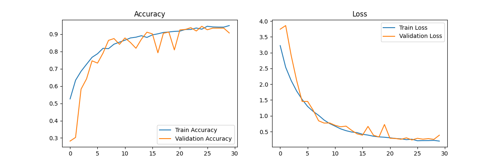
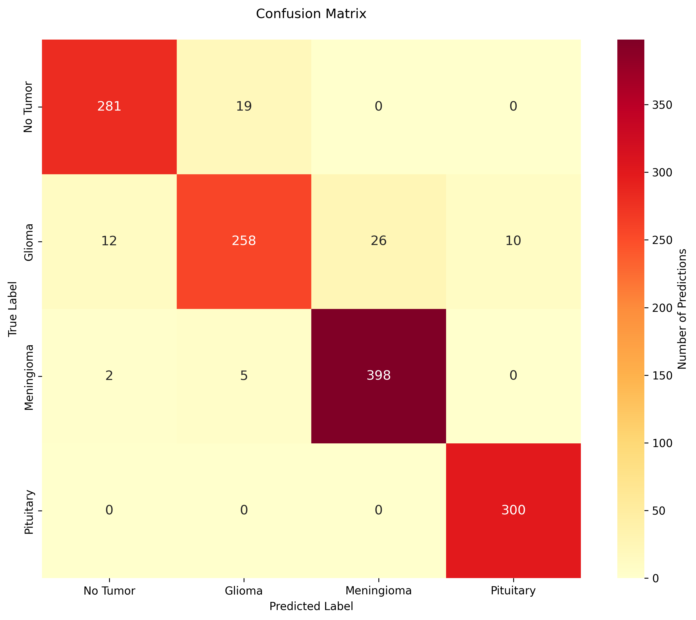

# Brain Tumor Classification using a CNN

This repository contains the implementation of a Convolutional Neural Network (CNN) for classifying brain tumors into four categories: **No Tumor, Glioma, Meningioma, and Pituitary**. The project includes data preprocessing, model training, evaluation, and visualization of results.

## Overview

This project aims to provide an automated solution for brain tumor classification using deep learning. Accurate classification can assist medical professionals in diagnosis and treatment planning.

## Dataset

The dataset used for this project is publicly available and can be accessed through [Kaggle](https://www.kaggle.com/datasets/masoudnickparvar/brain-tumor-mri-dataset). It contains MRI images of brain tumors classified into four categories:

1. **No Tumor**
2. **Glioma**
3. **Meningioma**
4. **Pituitary**

The data is split into training, validation, and testing sets, ensuring a balanced distribution of classes.

## Data Preprocessing

To prepare the dataset for training, validation, and testing, the following preprocessing steps were implemented in the `data_loading.py` script:

1. **Data Loading**
   - Images were loaded from directories and split into training, validation, and testing sets with consistent splits using a fixed random seed.

2. **Normalization and Resizing**
   - Images were resized to the target shape specified in the configuration and normalized by scaling pixel values to the range `[0,1]`.

3. **Data Augmentation**
   - Random horizontal flipping, brightness adjustment, and contrast adjustment were applied to improve model generalization.

4. **Optimization**
   - Techniques like shuffling, caching, batching, and prefetching were used to speed up data processing and training.

5. **Final Output**
   - Processed datasets were prepared as TensorFlow datasets, ready for input into the model.

## Model Architecture

The CNN model was built using TensorFlow/Keras. It consists of multiple convolutional layers followed by max-pooling, batch normalization, and dropout for regularization. The final layers include fully connected dense layers and a softmax activation function for classification. Some of its key features include:

- **Convolutional layers** with ReLU activation
- **Batch Normalization** for faster convergence
- **Dropout rates** from `[0.25, 0.5]` to reduce overfitting

The full model can be viewed in the `model.py` file.

## Training

During training, the model learns to classify images by minimizing the categorical cross-entropy loss function. Early epochs focus on extracting basic features such as edges and shapes, while later epochs capture more complex patterns specific to each tumor type. Dropout layers help prevent overfitting by randomly deactivating neurons during training. The training process is monitored using both training and validation datasets to ensure the model generalizes well. Some of the training parameters utilized were:

- **Epoch size** of 40
- **Adam optimizer** with a learning rate of 0.0005
- **Categorical cross-entropy** loss function
- **Early stopping** and **learning rate reduction**

Training and validation accuracy/loss curves were plotted to visualize the learning process and detect any signs of overfitting or underfitting, as seen below:

The model achieved steady improvements in accuracy across epochs, with validation accuracy closely following training accuracy, indicating good generalization. Additionally, training loss decreases consistently, while validation loss plateaus and fluctuates slightly, which is typical when the model reaches optimal performance.

## Evaluation and Final Results

Model evaluation is performed using the test dataset, which contains unseen data. Metrics such as **accuracy, precision, recall, and F1-score** are used to assess performance. A confusion matrix provides a detailed breakdown of a model's predictions for each class, highlighting areas of strength and weakness. An evaluation of this model can be seen below:

There was high accuracy when identifying **No Tumor** and **Pituitary tumors**; however, a few misclassifications were observed between **Glioma** and **Meningioma**, which may indicate overlapping features.

Overall, the CNN model demonstrated strong performance in classifying brain tumor types, achieving:

- **Training accuracy:** ~94%
- **Validation accuracy:** ~93%
- **Testing accuracy:** ~95%
